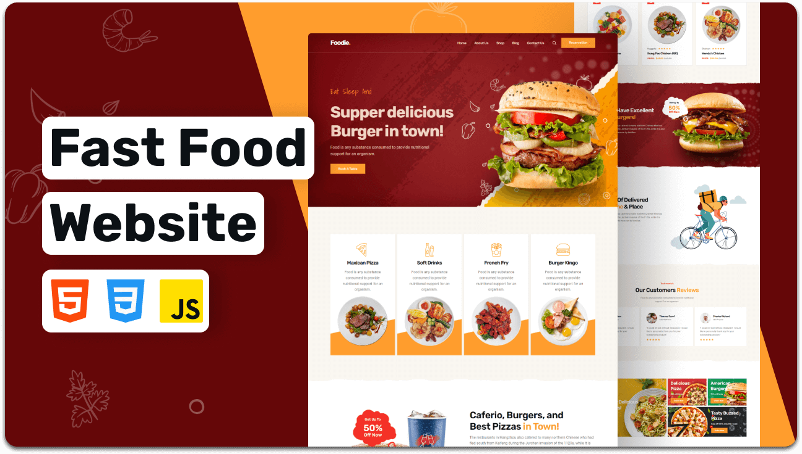

<div align="center">

  <h1 align="center">Foodie 🍔 - Fast food website</h1>

  Foodie is a fully responsive fast food website designed for food enthusiasts and businesses. <br />It features a modern, sleek design built with **HTML**, **CSS**, and **JavaScript**. <br />The website adapts perfectly to all devices, making it a great choice for showcasing fast food menus and services.


</div>

<br />

### 🌟 Features

- Fully responsive design, optimized for mobile, tablet, and desktop devices.
- User-friendly interface for browsing fast food options.
- Lightweight and fast loading, ensuring a seamless user experience.
- Simple and clean code structure for easy customization.

### 📸 Demo Screenshots

**Desktop View:**



### 🛠 Prerequisites

Before you get started, ensure you have the following installed:

- [Git](https://git-scm.com/downloads "Download Git"): To clone the repository and run it locally.

### 📂 Run Locally

Clone the project to your local machine using the following commands:

**For Linux/macOS:**

```bash
sudo git clone https://amancore.github.io/foodie/
```

**For Windows:**

```bash
git clone https://amancore.github.io/foodie/
```

### 📞 Contact

Feel free to reach out if you have any questions or suggestions:

- **Email**: [aman8804623822@gmail.com]
- **GitHub**: [amancore](https://github.com/amancore)
